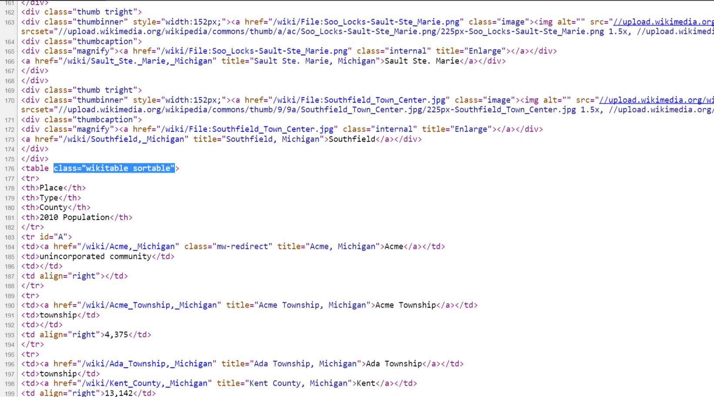
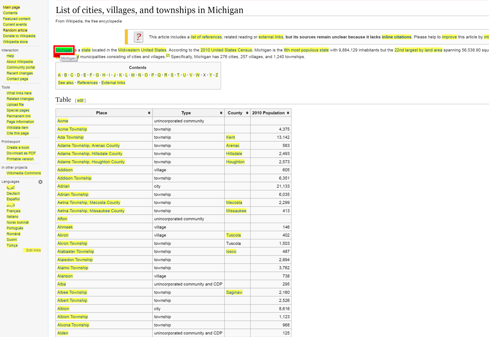

--- 
title: <span style="font-size:150%; font-variant:small-caps; font-style:italic; color:#1e90ff">webR</span>
author: "Michael Clark"
date: "`r Sys.Date()`"
site: bookdown::bookdown_site
output: 
    bookdown::gitbook:
      css: [../notebooks.css]
---

# Web scraping


We begin with a discussion on <span class="emph">web scraping</span>. The term itself is ambiguous, and could potentially mean anything[^otherwsnames], but the gist is that there is something out on the web (or some connected machine) that we want, and we'd like ot use R to get it. This section won't (at least for now) get into lower level utilities such as that provided by httr or Rcurl, though some packages will be using them under the hood.  Instead focus will be on higher-level approaches with an eye toward common tasks.


As a starting point, open a browser and go to a website of your preference. For most browsers, Ctrl+U will open up the underlying html file.  If you're on a typical webpage it will almost certainly look like a mess of html, javascript, xml and possibly other things. Simpler pages are actually somewhat able to be followed, while more complex/secure pages are not.  The take home message is that what you want is represented by something in there, and you'll have to know something about that structure in order to get it.

Unfortunately, web designers in general are notoriously bad at what they do[^webdesign], which will make your job difficult.  Even when the sole purpose of a site is to provide data, you can almost be sure that the simplest/most flexible path will not be taken to do so. Thankfully you can use R and possibly other tools to make the process at least somewhat less painful.

## Direct data download

One thing to be aware of is that you can get data in typical formats just as you would any file on your own machine.  For example:

```{r eval=FALSE}
mydata = read.csv('http://somewebsite/data.csv')
```


I wouldn't even call this web scraping, just as you wouldn't if you were getting a file off a network connection.  However, if you're just starting out with R, it's important to know this is possible.


## Key concepts

The web works in mysterious ways, but you don't have to know a lot about it to use it or benefit from its data.  Many people have had their own websites for years without knowing a lick of html.  For our purposes, it helps to know a little, at least so that we know what to look for.

Common elements or <span class="emph">tags</span> of a webpage include things like `div` `table` and `ul` and `body`, and within such things our data will be found.  Just like in R, these can have their own <span class="emph">class</span>, e.g. `<table class="wikitable sortable">`, and this allows even easier access to the objects of specific interest. As an example, take a look at the code from the wikipedia page for [towns in Michigan](https://en.wikipedia.org/wiki/List_of_cities,_villages,_and_townships_in_Michigan.



The <span class="emph">id</span> is another <span class="emph">attribute</span>, or way to note specific types of objects. Unlike classes, which might be used over and over within a page, ids are unique, and thus for web scraping, probably more useful.  Also, while elements can have multiple classes, they can have only one id.  Any particular element might also have different attributes that specify things like style, alignment, color, file source etc.

The sad thing is that these are greatly underutilized.  For example, perhaps you found a page with several html tables of data, one for each year.  It would have been simple to add an `id = year` to each one, enabling you to grab just the specific year(s) of interest, but it'll be rare that you'd find a page that goes that far.  Part of this could be due to the fact that much content is auto-generated via wysiwyg editors, but these are not professional pages if so, which might cause concern for the data given such a source.

In any case, you'll at least need to know the tag within which the data or link to it may be found.  Classes and ids will help to further drill down the web page content, but often won't be available.  See this [link](https://en.wikipedia.org/wiki/HTML_attribute) for more on relations between attributes and elements.


## Getting started

One of the packages that can make scraping easy is rvest, which is modeled after/inspired by the <span class=""></span>Beautiful Soup module in Python[^bs].  As the goal here is to get you quickly started, we won't inundate you with a lot of packages. I recommend getting comfy with rvest and moving to others when needed.

### Examples

We'll go through a couple examples.  Wikipedia has a lot of information, and an API, so that we can use it as an example later as well.

#### Wikipedia

A lot of Wikipedia has pages ripe for the scraping. Between the page layout and rvest it will be very easy to get the content. So let's do so.  Back to the page of towns in Michigan.  Let's see if we can get the table of towns with their type, county, and population.  First things first, we need to get the page.

```{r}
page = 'https://en.wikipedia.org/wiki/List_of_cities,_villages,_and_townships_in_Michigan'

library(rvest)

towns = read_html(page)
str(towns)
towns
```

The result of read_html is an xml_document class object. For the uninitiated, XML is a markup language (Extensible Markup Language) like HTML, and which we can access its parts as nodes in tree[^tree], where *parents* have *children* and *grandchildren* etc.  It will require further parsing in order to get what we want, but it was easy enough to snag the page.  Let's look at some of the nodes.

```{r}
html_nodes(towns, 'ul') %>% head   # unordered lists (first few)
html_nodes(towns, 'a') %>% head    # links 
html_nodes(towns, 'table')         # tables
```

Perhaps now you are getting a sense of what we can possibly extract from this page. It turns out that what we want is a table element, and in particular, the one that is of class `wikitable sortable`.  This will make things very easy.  But what if we didn't know what the element was?  it turns out there are tools like [SelectorGadget](http://selectorgadget.com) that can be used to inspect the elements of any webpage.  SelectorGadget can be added as a browser extension, which would allow you to easily turn it on and off as needed.  The following depicts what the Michigan towns looks like when using SelectorGadget and selecting a link.



#### sports


#### messy

imdb?


[^otherwsnames]: Called by various names by people with too much time on their hands: web harvesting, data scraping (presumptuous), etc.

[^webdesign]: Think about your R code, now remove the spaces, indent as irregularly as possible, do not commment anything, use reserved words for common names, don't name important parts of your site, reject any known coding style, and use default settings.  That would describe about 99% of the typical website design I come across.

[^bs]: I highly recommend [Beautiful Soup](https://www.crummy.com/software/BeautifulSoup/) also. Until rvest and related packages I preferred using BeautifulSoup to what was available in R.

[^tree]: Think graphical models rather than spruce.
