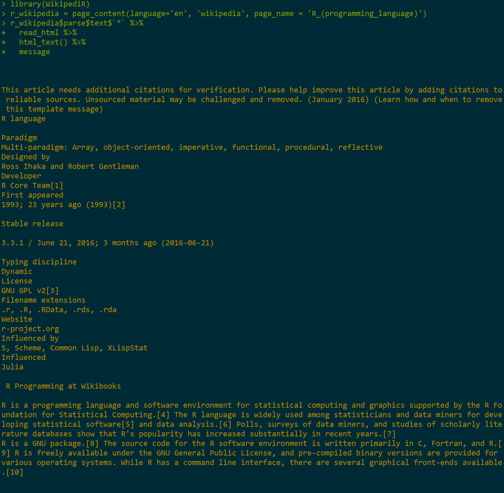

# APIs


An application programming interface allows one to interact with a website.  In the simplest situation, this is merely a url-based approach to grabbing what you need.

As an example consider the following generic url

`http://somewebsite.com/key?par1;par2`

The key ingredients are:

- the base url
- some authorization component (e.g. key)
- the parameters of interest that specify what you want to grab from that website.

With R, once we have authorization we can then simply feed the parameters that tell the server what data to provide.
We can do this in a raw fashion, where we make the url, or web adress, that has the necessary specification and simply take what it provides.  Alternatively, there are many R packages to make the process easier for things like Twitter, Qualtrics, and many, many other places.

One issue is that I find APIs are generally poorly documented after a certain level of detail, e.g. often telling you what the parameters are but not the values they can take on.  As an example, if something says it wants a date, you're left to guess what the date format is expected.  Just be aware that you may still have some guesswork left even if a lot of information is provided initially.


## Raw Example

Basic functions of the raw approach are requests to a server things like GET and POST, commands that tell the server to provide something or perhaps provide data to it.  In the following, `api` is an R object with a character string of the key provided to me by the website.  I use the httr package for the web functionality to acquire the content.  In particular, the GET function retrieves whatever information is noted by the request/url.  Additional arguments or modifications to the base url can also be provided, which is what the query part does.

```{r echo=FALSE}
source('nytimeskey.R')
```
```{r}
# raw approach
library(httr)
most_viewed_base = GET('https://api.nytimes.com/svc/mostpopular/v2/mostviewed/all-sections/30.json', query=list(`api-key`=api))
# see the url created
# most_viewed_base$url # tacks on ?api-key=YOURAPI at the end
```

At this point, most_viewed_base is a response class object, a list with several pieces of information including what we want, which is the content. 

```{r}
str(most_viewed_base[-1],1)
```

However the content's in binary, and to get it into a useful state we'll use the content function. The rest of the code just takes the title and arranges it by date


```{r}
most_viewed = content(most_viewed_base)
lapply(most_viewed$results, function(x) data_frame(title=x$title, date=x$published_date)) %>% 
  bind_rows() %>% 
  arrange(desc(date))
```


The community API can get user comments and movie reviews.  In the following case, it will need a specific date to retrieve comments.  

```{r}
comments_base = GET('http://api.nytimes.com/svc/community/v3/user-content/by-date.json', query=list(date=Sys.Date()))
comments = content(comments_base)
sapply(comments$results$comments, function(x) x$commentBody)[1:5]
```

The documentation doesn't make obvious what the date format should be, how the commments are chosen, or what the limits are.  As mentioned previously, this is typical API documentation in my experience.

## R packages

Many R packages allow extremely easy access to various websites through their API.  Usually all it takes is acquiring the authorization and the package will do the rest.  It might only be marginally less effort than the raw approach we did before, but can make things more efficient in the long run.

### New York Times Article Search

The following is an example of accessing the New York Times artical search API[^nytapi].

```{r}
library(rtimes)
article_search = as_search(q="bomb", begin_date = '20160918', end_date = '20160919')[-(1:2)]

lapply(article_search$data, function(x) data_frame(snippet=x$snippet, date= x$pub_date)) %>% 
  bind_rows() %>% 
  arrange(desc(date))
```


### Wikipedia

With the WikipediR package, getting the whole content of a page is just one possibility, and it feeds nicely into rvest functionality for more processing.

```{r eval=FALSE}
library(WikipediR)
r_wikipedia = page_content(language='en', 'wikipedia', page_name = 'R_(programming_language)')
r_wikipedia$parse$text$`*` %>% 
  read_html %>% 
  html_text() %>% 
  message
```




### Qualtrics

Qualtrics is a survey software which one can use to create and disseminate surveys and the data from them, and is a very useful tool in this regard.  The University of Michigan has a license, and so anyone at the university can use it.  

The qualtricsR package makes it easy to import data from and export surveys to Qualtrics, as well as functionality to create a standard survey within R.  As before you'll need proper authorization, but then it can be straightforward to grab your data from Qualtrics without having to go to the website.

```{r, eval=F}
mydata = importQualtricsData(username = "qualtricsUser@email.address#brand",  # example micl@umich.edu#umich
                             token = "tokenString", surveyID = "idString")    # your token from Qualtrics
```


## Restrictions

Note that there are almost always restrictions. For example, the New York Times API limits requests to 1000 calls per day, and five calls per second.  Unfortunately these are typically not based on actual testing of what modern servers could handle and are often overly restrictive (and overly optimistic in estimates of web traffic) in my opinion.   I mention it though because you'll need to plan ahead.  If you need a 1 million requests, but the API restricts you to 1000 a day, you'll obviously need some other way to get the data you want.  A simple request for more flexibility might be all that is needed.


[^nytapi]: There are several APIs for different types of content.
