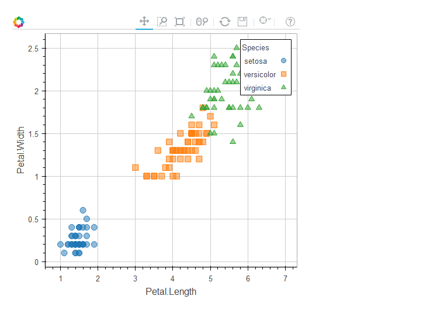
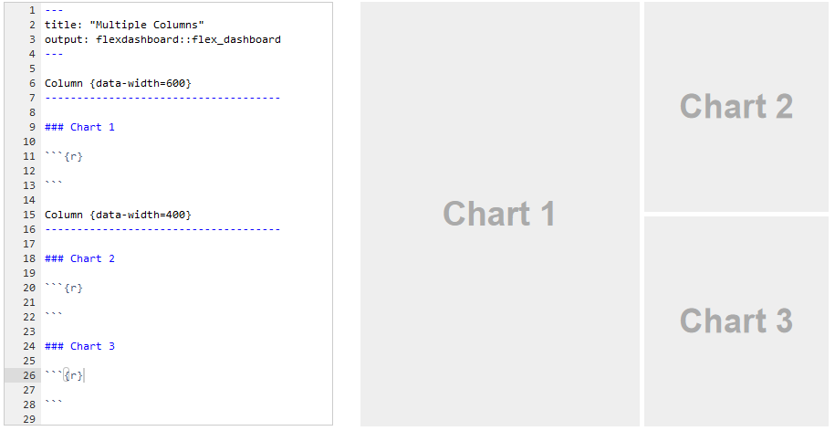
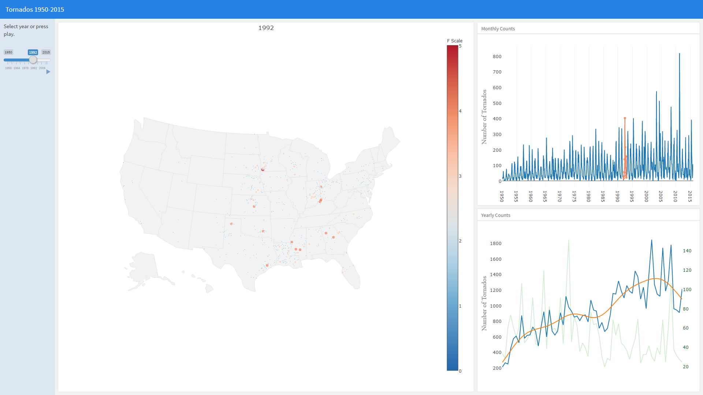

# Visualization

For standard approaches, R already is one of the more powerful data visualization tools out there, to the point where the look of its graphics is being replicated across other platforms.  However, R has come a long way very quickly with regard to interactive and web-based visualization, such that it is as easy to do an interactive, web-ready graph as it is the standard plot.  The following provides an overview of tools to be aware of for web-based visualization in R.


## Systems

This section notes a couple packages which I will call visualization systems. For example, for static plots <span class="pack">ggplot2</span> and <span class="pack">lattice</span> are systems within which to produce visualizations. They have their own consistent style within which to specify the details of a plot and are very flexible in what they can produce.

In that sense I'll note two interactive visualization systems, <span class="pack">plotly</span> and <span class="pack">bokeh.</span>

### plotly

<span class="pack">Plotly</span> is a general visualization system with APIs for javascript, Python, Matlab, and of interest to us, R. It used to require an account but now is used as any other package within R, and in this case the package is just called plotly.  Like <span class="pack">ggplot2</span>, you start with a base and add layers via pipes.

```{r plotlyExample}
library(plotly)
x = sort(rnorm(1000))
g = rep(0:1, 500)
y = g + sin(x) + .25*g*sin(x) + rnorm(1000, sd=.1)

plot_ly(x=~x, y=~y, color=factor(g)) %>%
  add_trace(x=x, y=y, color=factor(g), mode='lines+markers') %>% 
  lazerhawk::theme_plotly()

iris %>%
  plot_ly(x=~Petal.Length, y=~Petal.Width, color=~Species)
```

By default the plot is interactive, but you can add a lot more too it (my own theme cleans up gridlines, zero reference line etc.).

One of the best things about plotly is it's ability to make a ggplot graphic interactive. The resulting visual may need further tweaking as there is not a one-to-one mapping from ggplot to plotly, but it's otherwise a very useful tool.

```{r gg2plotly, eval=-1}
ggplot(aes(x=Petal.Length, y=Petal.Width, color=Species), data=iris) +
  geom_point()
g = ggplot(aes(x=Petal.Length, y=Petal.Width, color=Species), data=iris) +
  geom_point()
ggplotly(g)
```

Unfortunately the [documentation](https://plot.ly/r/) for <span class="pack">plotly</span> is very poor in my opinion.  Every page on the website requires loading images that still take time even on very fast connections, there is so much unused whitespace that it can be difficult to tell which part of the functionality you're reading about, examples are not consistent from language to language even for things that should not require different demonstrations, lack of comments explaining the code, etc.  In short it can be frustrating to learn, and often you may have to go to the Python or javascript examples to get more detail than the R example provides.  And of course, there is always [SO](http://stackoverflow.com/questions/tagged/plotly).


### rbokeh

[Bokeh](http://bokeh.pydata.org/en/latest/) is a Python interactive visualization library, and <span class="pack">rbokeh</span> is an attempt to port it to the R world.  It works very similarly to <span class="pack">plotly</span>, and for easy comparison I iterate the iris example from above.  The figure function serves to produce the base of the plot, with other elements added as layers via pipes.  It doesn't appear to mesh well with bookdown yet so I simply show the image you'd see in your Rstudio viewer.

```{r rbokeh, eval=FALSE}
library(rbokeh)
iris %>% 
  figure(width=500, height=500) %>%
  ly_points(Petal.Length, Petal.Width, data = iris,
    color = Species, glyph = Species,
    hover = list(Petal.Length, Petal.Width))
```


More on <span class="pack">rbokeh</span> can be found [here](http://hafen.github.io/rbokeh/).


### Others

I'll note that <span class="pack">ggvis</span> was once considered to be the successor to <span class="pack">ggplot2</span>, providing all the same stuff but specifically to add interactivity and web-based visualization.  Development has stalled, probably due to the fact that things like plotly and bokeh attempt the same thing, but are used in other programming languages as well.  I do not recommend spending any time learning <span class="pack">ggvis</span> until development picks back up, and even then, <span class="pack">plotly</span> and <span class="pack">rbokeh</span> will likely be more developed and still have the cross-language advantage.


## htmlwidgets

Many newer visualization packages take advantage of <span class="emph">javascript</span> for graphical web-based display, as well as the piping approach to add layers of visual information to a plot. <span class='pack'>htmlwidgets</span> is a package that makes it easy to create javascript visualizations, similar to what you see everywhere on the web.  The packages using it typically are pipe-oriented (`%>%`) and specifically produce interactive plots.


### Leaflet example

The following example utilizes the <span class="pack">leaflet</span> package.  Aside from the icons, you can create this same interactive graph from essentially nothing. As with most graphing approaches in R, we start with a base, which may or may not contain additional layout or other information. From there we add subsequent layers of information/visuals until the final goal is reached. The final product is an interactive map with popups when the icons are clicked.


```{r leaflet}
Rlogo = file.path(R.home('doc'), 'html', 'logo.jpg')

points = cbind(lon=c(-83.738233,-83.7582789), lat=c(42.280799, 42.2668577)) # latitude and longitude locations

library(leaflet)
leaflet() %>%                                                           # base plot nothing to see
  addTiles() %>%                                                        # base plot, the whole world
  setView(mean(points[,1]), mean(points[,2]), zoom = 14) %>%            # set location
  addMarkers(points[,1], points[,2],                                    # add points etc.
             icon=list(iconUrl=c('../img/Rlogo.png', 'img/UM.png'),
                       iconSize = c(75, 75)),
             popup = c('CSCAR', 'Big House'))
```

See the [htmlwidgets website](http://www.htmlwidgets.org/) for more examples and other packages.


## Shiny

<span class="emph">Shiny</span> is a framework within which to use R to build interactive web-based applications.  Essentially you can create a website[^sitevsapp] that allows interactive data creation, analysis and visualization.  While you can use it easily enough on your own machine, it will not work for the web unless you have access to a an actual machine that can serve as the Shiny server. [shinyapps.io](http://www.shinyapps.io/) allows you to create 5 apps for free, with the possibility to pay for more. 

### Server

You write two parts of code to use Shiny, and neither is in a fashion in which one typically uses R. The <span class="emph">server</span> determines how inputs will produce outputs for the application.  It actually may have some more or less standard R code, as one extracts parts of data, produces plots etc.  However, most of it will be wrapped as an <span class="emph">expression</span> within another R function, which itself is wrapped in a main function called <span class="func">shinyServer</span>.

The following comes from one of the Shiny tutorials and demonstrates the server setup. Note that you can define the server and ui as separate R files that are then called by the <span class="func">runApp</span> function.  

```{r shinyServer, eval=FALSE}
library(shiny)

# Define server logic required to draw a histogram
shinyServer(function(input, output) {

  # Expression that generates a histogram. The expression is
  # wrapped in a call to renderPlot to indicate that:
  #
  #  1) It is "reactive" and therefore should be automatically
  #     re-executed when inputs change
  #  2) Its output type is a plot

  output$distPlot <- renderPlot({
    x    <- faithful[, 2]  # Old Faithful Geyser data
    bins <- seq(min(x), max(x), length.out = input$bins + 1)

    # draw the histogram with the specified number of bins
    hist(x, breaks = bins, col = 'darkgray', border = 'white')
  })

})

```

### UI

The <span class="emph">UI</span> stands for user interface and defines how someone will interact with the inputs and the look of the page.  This is where you essentially create the webpage where the user can adjust settings or other aspects which might then change an analysis, visualization or whatever.  This is also where you will likely find more of the R code used in a fashion unlike your normal usage. And I hope you like parentheses.

In the following the <span class="func">shinyUI</span> function, like the <span class="func">shinyServer</span> function before, wraps the rest of the code. Additional functions are used to create sidebars, interactive inputs, titles etc.

```{r shinyUI, eval=FALSE}
# Define UI for application that draws a histogram
shinyUI(fluidPage(

  # Application title
  titlePanel("Hello Shiny!"),

  # Sidebar with a slider input for the number of bins
  sidebarLayout(
    sidebarPanel(
      sliderInput("bins",
                  "Number of bins:",
                  min = 1,
                  max = 50,
                  value = 30)
    ),

    # Show a plot of the generated distribution
    mainPanel(
      plotOutput("distPlot")
    )
  )
))
```

To see the app in action, simply install the <span class="pack">shiny</span> package and run the following code:

```{r shinyExample, eval=FALSE}
shiny::runExample('01_hello')
```


The shiny framework is very powerful in terms of what it can do, but realize you are basically creating a web app using a language that wasn't designed for general programming in that fashion and will require outside resources if you want to use it.  It is very likely that other approaches would be more efficient and notably lighter weight[^slowshiny], resulting in a better user experience, which is what your number one priority should be if you are constructing an interactive app.  That said, shiny can be a lot of fun, and useful for presentations too if running it from your own device.


## Dashboards

The <span class="objclass">flex_dashboard</span> output format allows one to quickly create a dashboard type webpage complete with whatever interactivity you may want. In a sense it comes off as a Shiny shortcut, enabling you to create a webpage quickly and easily by letting the default mode do more of the work behind the scenes.

Consider the following image.  The only R code necessary to start building a dashboard with the layout on the right is not even seen, it's just part of the underlying markdown that comes with it.  Whatever you put in the R chunks will show up in the corresponding chart position.



As an example, I'd never used <span class="objclass">flex_dashboard</span> before and it only took part of an afternoon to get the data and produce the following dashboard that looks at tornados in the U.S. over time (click image to see the app). It's still demonstrates the slowness that can come with a shiny app, but it was relatively easy to put together.  All plots use <span class="pack">plotly.</span>

<a href="https://micl.shinyapps.io/tornados/"></a>


[^sitevsapp]:  A lot of folks these days seem to confuse what a software application is, and what a website is, to the point that many actually call what is akin to a url shortcut an 'app' (e.g. the Netflix app just takes you to netflix.com).  In general, software applications do not require the web, and a web app is basically a website that functions similar to a software application that might run on your desktop or other device. Shiny has many functions that essentially create the html, javascript etc. you would otherwise have written.  Whether you want to call the result an app is up to you, but using Shiny won't qualify you to call yourself a software developer.  This point is also made because nowadays Shiny is actually unnecessary to create interactive webpages/sites (e.g. this document does not Shiny).  If all you want is some basic interactivity, you may be able to do that with the other packages noted.

[^slowshiny]: Shiny apps take a while to load and may be slowly implemented.
