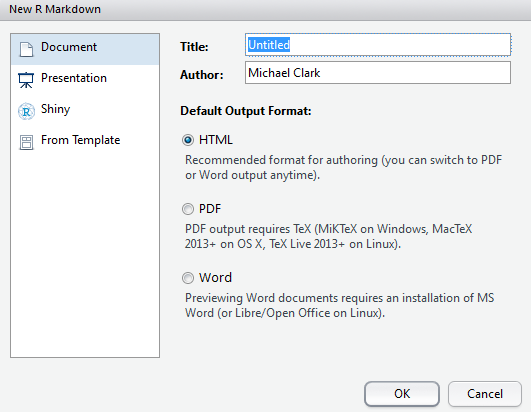
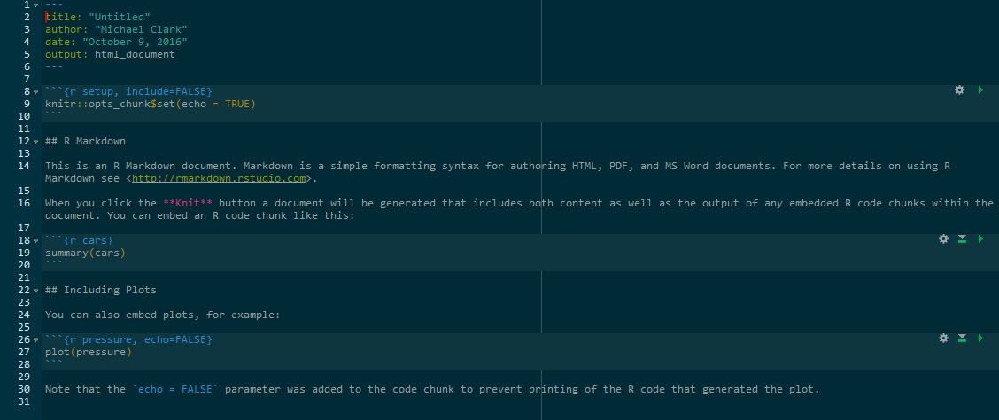
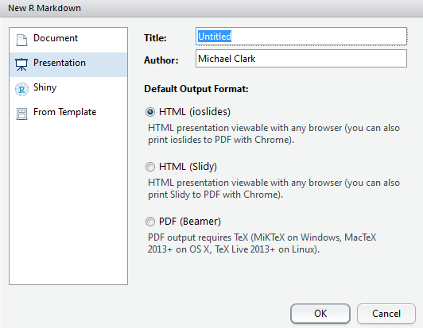

# Publishing

The publishing capabilities in R are phenomenal, and keep expanding all the time.  From traditional document types (including pdf and MS Word) to building whole websites with loads of interactivity, R can generally take you where you want to go.  The ability to imbed the data in the document is clearly important in academia for the facilitation of ideas and discovery, as well as conducting more reproducible research.  However, such capabilities can benefit anyone.

## Publishing Languages

### Markdown 

[Markdown](http://daringfireball.net/projects/markdown/) serves as the basis for much of the approach.  Markdown provides an easy way to create html products without coding any raw html.  It is extremely limited in this regard, but for most text it's all you need.  Despite it's utility, there is no standard for markdown and it hasn't been developed in years. Thus there are many flavors of markdown, of which R Markdown is one.

### R Markdown

R Markdown is Markdown with some other stuff that allows you to work with R.  Like shiny is for webpages, it's a framework for authoring with data science in mind.  You no longer ever need your documents and data to be separated[^journals].

The basic process is that you write an R Markdown document and it is then converted into the desired format via other tools, e.g. html or pdf.  Use `File/New File/R Markdown...` in RStudio to get started.

The following shows what a markdown file might look like. You see YAML for the first few lines, basic text intermingled with basic markdown (e.g. \** adds bold, # are headers), and R chunks, where R code resides. The R code itself may remain hidden, exposed but not run, or run along with the rest of the output and the results shown in the text.

Much of this process is made possible via the knitr package, which takes the .Rmd file and *knits* it into the desired format, using things like [pandoc](http://pandoc.org/) and other tools to do so.

You can always change the output, so it doesn't really matter what you select at the initial point. It might be obvious, but you'll need outside programs for some things.  For example, you can't knit a MS Word doc[^msword] if MS Word is not installed on your computer. Likewise, you'll need a $\LaTeX$ installation to create a pdf.  You should also know that what a document renders to in html will not have the exact same look in pdf or MS Word, nor could it be expected to.  If you select an inferior or less flexible format for your publication, don't expect all the bells and whistles that worked in a better format.

### HTML, CSS etc.

HTML is what is behind most of the web that you actually see and interact with, allowing one to create a webpage in a mostly tabular format of some kind. CSS allows you have a consistent style across a collection of pages usually amalgamated to form an entire website.  Javascript allows one to build applications that run within the browser, and a host of other languages process data on the server side.  You don't need to know these languages to produce documents with R, but the more you know of them the more you can enhance and customize them.

### $\LaTeX$

It used to be the case that $\LaTeX$ served as the primary means for producing high-quality documents in academia.  Some are still under the impression this is the case, but these days, pdf and similar print-first output is neither necessary nor really should be the chief means of scientific communication.  $\LaTeX$ is still useful for forumlas, but even that is translated via Mathjax, which is a javascript library that essentially reproduces the math functionality of $\LaTeX$.  For example, inserting the following bit in an R Markdown document `$$y = X\beta + \epsilon$$` will produce the following when the document is 'knit':

$$y = X\beta + \epsilon$$

One can also use various latex packages as well if needed.  However, with R Markdown, using raw latex is rarely needed outside of formal mathematical exposition. There are several packages such as xtable

### YAML

YAML (or YAML Aint Markup Language) serves as the means to configure your R Markdown files[^yaml].  The syntax is very simple, and in the context of an R Markdown document, it allows you to specify things like the output type, title, other css files to use, and so forth. This will start any R Markdown file you use unless you have one main file that calls other Rmd files.

### Pandoc

Pandoc is a universal converter, allowing documents to flop from one format to another.  It reads the markdown, HTML, $\LaTeX$, and everything else and converts it to an HTML, pdf etc. document.  

## Document Formats

### HTML

HTML is the default output for R Markdown documents, and really should be your default as well.

### Notebooks

I've been using notebooks since they were first advertised as part of an RStudio preview release.  It is still not clear to me what their role is, other than to allow your output to reside in your R markdown document rather than the console, something typically not desirable (at least with how I use R).  I guess it's useful if you want to share the document and let someone else play with the code, but technically they could do that with an R Markdown document anyway, or a basic R script for that matter.  Having the output below or to the side of the document rather than a few inches from that point is not something I can get overly excited about.  And sometimes there is a lot of output from a chunk that I definitely do not want clogging up the code or document.

That said, notebooks will be highly useful for educational purposes, and more so if they make it such that the notebooks run in Jupyter.  Stay tuned to see how this document format pans out.

### Print-based

For print based approaches you have pdf, MS Word, RTF, ODF.  As mentioned, you will need to have something else installed (e.g. a Tex installation for pdf) in order to use these.  Furthermore, you should think very hard about whether you need them, as you will sacrifice your document's capabilities and look in some fashion.

### Journals

There is some support for Elsevier journals (assuming you're not [boycotting](https://en.wikipedia.org/wiki/The_Cost_of_Knowledge) them) and some specific ones that the R crowd would be interested in such as the Journal of Statistical Software.  More may be available via packages.

## Presentations

Some of the presentations for my [CSCAR workshops](https://m-clark.github.io/workshops/) use revealjs or similar for a web-based approach, though I find slides highly restrictive for conveying information that isn't visual.  For better or worse, at present there are multiple types of presentations one might use in R.  

- ioslides:	HTML presentation with ioslides
- reveal.js:	HTML presentation with reveal.js (requires revealjs package/template)
- Slidy:	HTML presentation with W3C Slidy
- Beamer:	PDF presentation with LaTeX Beamer

These days I cannot think of a reason to do a set of pdf slides as there is no benefit to doing so. The others are more configurable and can work on any device as easily.  Given that you can run something like an interactive shiny app as part of a presentation, why would you give that up?[^ripbeamer]

## Other formats

- bookdown	HTML, PDF, ePub, and Kindle books
- Websites	Multi-page websites. 
- Tufte Handout	Handouts in the style of Edward Tufte
- Package Vignette	R package vignette (HTML)
- Github Document	GitHub Flavored Markdown document.

Some notes about these formats. This document was created with bookdown, so that should give you some idea about its capabilities.  The website format is not shiny nor just the standard html doc output, but a format of its own.  The Tufte handouts work very well for pdf, and perhaps for standard html versions, but I've had issues with bookdown and the Tufte output is not well documented for it.  Package vignettes are very useful if you actually create an R package, but can otherwise be ignored.  A github doc isn't much different from standard markdown, so may be of limited use, assuming you are using Github in the first place.

## Other

### Customization

For customization you'll need to learn at least a little HTML and CSS, and possibly quite a bit once you go down the rabbit hole, along with other languages such as javascript.  This goes for all R markdown based document formats.  I find it necessary to get things how I want them, but you may be fine with default themes etc.

In addition, user created formats with custom looks or functionality are now coming into play, and will provide other formats beyond what you can get from the RStudio crowd. 

### Rpubs

with an [Rpubs](https://rpubs.com) account, you can publish your documents directly to the web for easy dissemination.  This allows you to share any of your R creations with ease.

### More

I'll add more stuff here as I come across it.

[^journals]: Unfortunately, many journals still seem to think it's 1985 where people mostly access them in print form in the library.  These are also journals that aren't being cited as much anymore.  Accessibility and openness are the hallmarks of science, and any journal outlets that have not figured this out should not be allowed to ride the coattails of their past status.

[^msword]: I've yet to come across any reason to still be using MS Word nowadays.  It is easier to create an MS Word document via markdown than it is to use the program itself.

[^ripbeamer]: R.I.P. beamer.

[^yaml]: There are other things that YAML is that I do not understand or care to.

[^jupyterR]: You can already use R with Jupyter,
